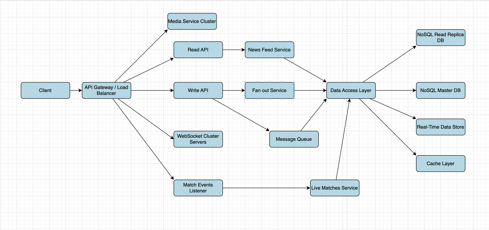

# HW17_Peak_Loadings

## What needs to be done:

1. Analyze all types of pages on the site.
2. Analyze and list possible sources of peak loadings.
3. Describe possible solutions for each type.

---

## Pages

### 1. Home Page
- **Latest News**: Up-to-date articles on football events, player transfers, and match outcomes.
- **Transfers News**: Detailed information on player transfers, including rumors and confirmed deals.
- **Match Schedule**: Upcoming fixtures across various leagues and competitions.
- **Live Scores**: Real-time updates on ongoing matches.

### 2. News Section
- **Articles**: In-depth coverage of football news, including interviews, analyses, and opinion pieces.
- **Categories**: Organized by topics such as international football, club news, and player profiles.

### 3. Scores Page
- **Live Scores**: Real-time updates on matches in progress.
- **Match Schedule**: Comprehensive list of upcoming fixtures.
- **League and Team Search**: Functionality to filter scores and schedules by specific leagues or teams.

### 4. Match Page
- **Overview**: Summary of match details, including teams, date, and venue.
- **Live Commentary**: Minute-by-minute updates and key events during the match.
- **Statistics**: Detailed match stats such as possession, shots, and player performance.
- **Line-ups**: Information on starting players and substitutes for both teams.

---

## Possible Peak Loading Sources

### 1. Live Data (Match Overview Page)
- **Problem**: High-profile live matches result in significant increases in real-time connections (WebSockets).
- **Solution**:
  - **Horizontal scaling of WebSocket Servers**:
    - **Auto-Scaling Groups**: Automatically scale the number of WebSocket server instances based on real-time demand.
    - **Stateless WebSocket Servers**: Design WebSocket servers to store session data in a distributed cache like Redis for easy scaling.
    - **Load Balancing**: Use a load balancer (e.g., AWS Application Load Balancer, NGINX) to evenly distribute connections.

### 2. Read-Heavy Systems (News Articles with Sudden Popularity)
- **Problem**: Viral news articles or events cause unexpected spikes in read requests.
- **Solution**:
  - **Content Delivery Network (CDN)**:
    - **Edge Caching**: Serve static and dynamic content through a CDN to reduce the load on origin servers.
    - **Geo-Distributed Servers**: Use CDN servers close to users to minimize latency.
  - **Caching Strategies**: Implement in-memory caching systems (e.g., Redis) for frequently accessed data.
  - **Database Optimization**:
    - **Read Replicas**: Use replicas to distribute read traffic.
    - **Database Sharding**: Horizontally partition the database to spread the load across multiple servers.
  - **Scalable Infrastructure**:
    - **Auto-Scaling Web Servers**: Automatically scale server instances based on CPU or network utilization.
    - **Stateless Application Servers**: Design stateless servers, storing session data in distributed caches.

### 3. Write-Intensive Systems (User Comments During Events)
- **Problem**: High user interaction during major events increases write load.
- **Solution**:
  - **Message Queues**: Use systems like RabbitMQ or Kafka for asynchronous processing of write operations.
  - **Database Scaling**: Implement horizontal scaling of the database to handle increased write throughput.

## Possible Solution
